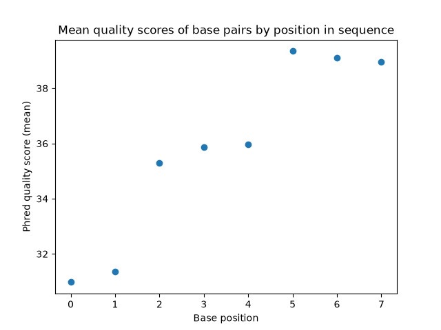
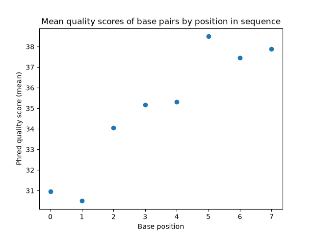
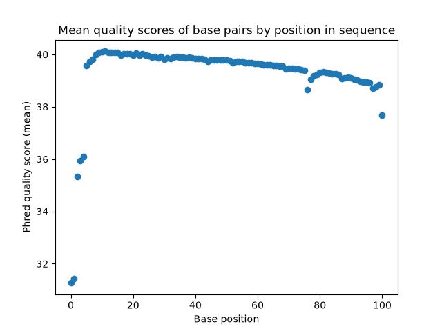
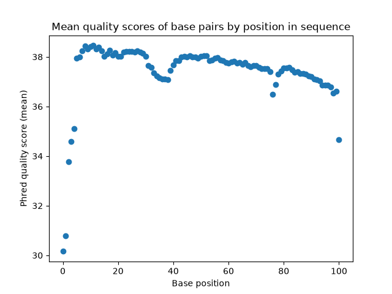

# Assignment the First

## Part 1
1. Be sure to upload your Python script. Provide a link to it here:

| File name | label | Read length | Phred encoding |
|---|---|---|---|
| 1294_S1_L008_R1_001.fastq.gz | read1 | 101 |  |
| 1294_S1_L008_R2_001.fastq.gz | index1 | 8 |  |
| 1294_S1_L008_R3_001.fastq.gz | index2 | 8 |  |
| 1294_S1_L008_R4_001.fastq.gz | read2 | 101 |  |

2. Per-base NT distribution

    1. 

    Index 1

    

    Index 2 

    

    Read 1

    

    Read 2

    

    2. 
    
    For index reads, the mean quality scores of base pairs range from a little under 31 to over 38. The first two nucleotides in the index are of significantly lower quality than the rest of the sequence, likely due to how many of the indexes start with N. Without considering those, the rest are all above 33, which I propose as the quality score cutoff for indexes.

    For biological reads, read 1 has significnatly higher quality than read 2. Most of the base pairs in read 1 are above 38, while almost all base pairs in read 2 are below 38. With that in mind, they are all consistently above 36, which I propose as the quality score cutoff for biological reads. 

    3. 3976613 from R1 and 3328051 from R2. 
    
## Part 2
1. Define the problem
2. Describe output
3. Upload your [4 input FASTQ files](../TEST-input_FASTQ) and your [>=6 expected output FASTQ files](../TEST-output_FASTQ).
4. Pseudocode
5. High level functions. For each function, be sure to include:
    1. Description/doc string
    2. Function headers (name and parameters)
    3. Test examples for individual functions
    4. Return statement
