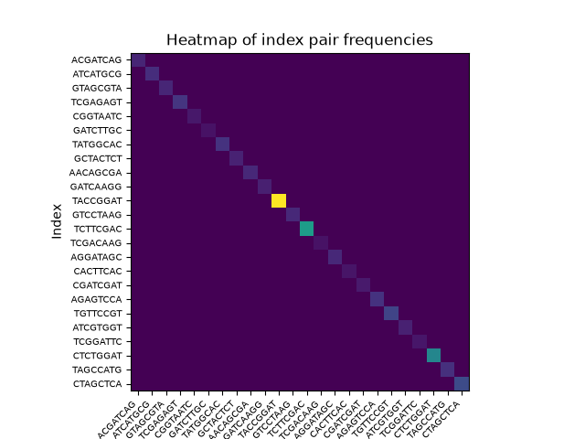
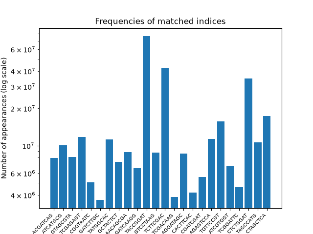

# Demultiplex
### Author: Pen Hanks

### Date created: 7/21/26

### Description :
 [Assignment the First](Assignment-the-first)
- [Part 1](Assignment-the-first/README.md#part-1--quality-score-distribution-per-nucleotide): Quality Score Distribution per-nucleotide
- [Part 2](Assignment-the-first/README.md#part-2--develop-an-algorithm-to-de-multiplex-the-samples): Develop an algorithm using psuedocode to de-multiplex the samples

[Assignment the Second](Assignment-the-second)
- Review peer psuedocode

[Assignment the Third](Assignment-the-third)
- Write the code

# Overview

updated 8/11

## Assignment the first

### Part 1

### Part 2
First attempt at pseudocode is `draft_of_code.md` and the final pseudocode is `PH_part_2_pseudocode.md`. Received feedback that my quality score check was for the read and not for the index, so I corrected it.

## Assignment the second

Gave feedback to Adrian, Hannah K, and Lisa. Details on GitHub.

## Assignment the third

### usr/bin/time 

Command being timed: `./demux.py -f /projects/bgmp/shared/2017_sequencing/1294_S1_L008_R1_001.fastq.gz -fi /projects/bgmp/shared/2017_sequencing/1294_S1_L008_R2_001.fastq.gz -ri /projects/bgmp/shared/2017_sequencing/1294_S1_L008_R3_001.fastq.gz -r /projects/bgmp/shared/2017_sequencing/1294_S1_L008_R4_001.fastq.gz -i /projects/bgmp/shared/2017_sequencing/indexes.txt -l /scratch/bgmp/penhanks/Demultiplex_out/`

- Time
    - User time (seconds): 2201.12
	- System time (seconds): 19.37
    - Elapsed (wall clock) time (h:mm:ss or m:ss): 46:58.55
- CPU
    - Percent of CPU this job got: 78%
- Memory
    - Maximum resident set size (kbytes): 251492

### Output files
Created the expected files. First read files start with "forward_" and second read files start with "reverse_"

Also created count_index_pairs.tsv, which contains columns of the first index, second index, and amount of time that pair appeared together. This was then used `graphs.py` to create the graphs and other printed output. 

### Percentage of reads from each sample

2.394% of the total matched reads were from index ACGATCAG 

3.041% of the total matched reads were from index ATCATGCG

2.447% of the total matched reads were from index GTAGCGTA

3.539% of the total matched reads were from index TCGAGAGT

1.527% of the total matched reads were from index CGGTAATC

1.098% of the total matched reads were from index GATCTTGC

3.371% of the total matched reads were from index TATGGCAC

2.236% of the total matched reads were from index GCTACTCT

2.674% of the total matched reads were from index AACAGCGA

1.986% of the total matched reads were from index GATCAAGG

23.018% of the total matched reads were from index TACCGGAT

2.662% of the total matched reads were from index GTCCTAAG

12.688% of the total matched reads were from index TCTTCGAC

1.161% of the total matched reads were from index TCGACAAG

2.614% of the total matched reads were from index AGGATAGC

1.263% of the total matched reads were from index CACTTCAC

1.689% of the total matched reads were from index CGATCGAT

3.411% of the total matched reads were from index AGAGTCCA

4.742% of the total matched reads were from index TGTTCCGT

2.076% of the total matched reads were from index ATCGTGGT

1.39% of the total matched reads were from index TCGGATTC

10.543% of the total matched reads were from index CTCTGGAT

3.204% of the total matched reads were from index TAGCCATG

5.224% of the total matched reads were from index CTAGCTCA

### Total and percentage values

Number of properly matched read-pairs: 331757402

Proportion of read-pairs that were properly matched: 0.9133114493100675

Number of pairs with index-hopping observed: 707740

Proportion of read-pairs with index-hopping observed: 0.0019483726398807136

Number of pairs with one or more unknown indices: 30781593

Proportion of read-pairs with one or more unknown indices: 0.08474017805005185

### Images

# Log
## 8/11/2026
### Code editing
I forgot to remove all iterative print statements from `demux.py`, which created a enormous slurm out file (oops), so I removed that.

I also forgot to add the hopped indices to my hopped index dictionary, so I ran it again with both of these changes

### Figure generation
This took me Way Longer than I wanted it to. I created two figures, a heatmap and a bar chart. I wish I was able to log scale the color gradient on the heatmap, but I couldn't figure it out. I also don't think my bar chart was the most informative, given that I restate that information later, but eh, its too late.

## 8/2/2026:
Why did it take me so long to run my scripts on a test file. No idea. Anyways

### Demux.py
I realized how confusing the whole R1,R2 thing was, so I attempted to rename R1 and R2 to forward and reverse. I may decide I hate it and redo it, but I think it makes things less confusing for right now

### Input and output files
Was it more work to find actual records that worked for this? Probably. I took the first two records from the files as the unknowns, the two full records in `zcat 1294_S1_L008_R2_001.fastq.gz | head -n 200000 | tail ` as the correctly matched ones, and then I swapped their indexes for the swapped one. They are unfortunately confusingly named, and for that I am sorry.

### Scripting for assignment the first
Oh god was this a headache. Ran the first two and last two reads in two separate scripts so it wouldnt take as long, and put the indexes first so I could confirm that it was working faster. Had to add a lot of toggles in functions and scripts in order for this to run correctly, but I finally did get it! 

## 7/29/2026: Assignment the third (and first)
Started reviewing the comments I got, made revisions to pseudocode

Started working on python script, `demux.py`, and made a bunch of revisions to the way I was opening the 48 files for the correctly paired records. Now made a dictionary that contains the file paths and file handles.

I dont know the best way to have my write_output_file function do what I want it to without adding redundancies later

the dictionary index_pairs has tuples as keys and i dont know how I feel about it.

Can't currently test anything bc I don't have access to talapas (cause I left my phone at home)

## 7/22/2026: Assignment the first (part 2)

Renamed `pseudocoding.md` to `PH_part_2_pseudocode.md`

- Revised doc string and expected output for write_output_file
- Created dict_hopped_indices, which contains unordered unmatched pairs as keys 
- Added quality score clarification in initial if statement in algorithm
- Added two histograms in Output: Graph: section

## 7/21/26: Assignment the first

### Part 2 / Pseudocode
Started by creating barely fake python code, `pseudocode.md`, and then started over in `pseudocoding.md` (very different i know)
- Got mostly Leslie approval on `pseudocoding.md`
- Adding more english to it

Wrote reverse_complement in `bioinfo.py`, confirmed it worked with a couple of assertations

Leslie said to open all the files at the beginning of the script instead of each time in a dictionary

#### Current output ideas
print counts of matched, hopped, and unknown
print proportion of how many of the total pairs were matched, hopped, and unknown

histogram or bar graph of index_dict

#### Need to do
Finish writing write_output_file function doc string.

Finish writing expected output of write_output_file

Continue to brainstorm outputs
- more graphs?
- graphs of all index pairs, both matched and hopped
    - and maybe even matched hopped and unknown?
    - maybe make a dictionary of all possible hopped index pairs?

Have someone else go over my script (maybe rea?)
